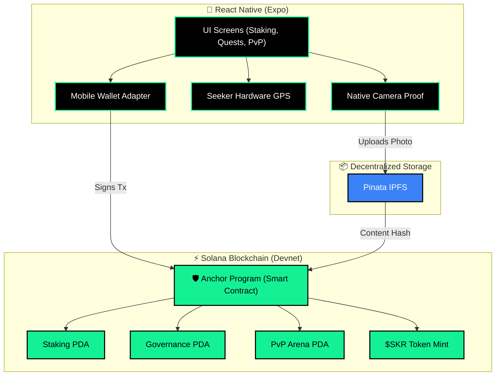

# 🌍 EcoQuest Mobile — Regenerative Finance on Solana Seeker

> **"Turn Real-World Environmental Action into On-Chain Value."**

EcoQuest is a **DePIN-powered mobile dApp** built natively for **Solana Seeker**. Users complete real-world environmental quests (planting trees, cleaning rivers, documenting biodiversity), earn **$SKR tokens**, stake for rewards, vote on governance, and battle in PvP arenas — all verified on-chain with GPS anti-cheat and camera proof.

**🏆 Built for the Monolith — Solana Mobile Hackathon**

---

## 🎯 The Problem

Millions of environmental apps exist, but **none create verifiable, trustless proof** of real-world action. Users can fake GPS, submit stock photos, and game reward systems. There's no economic incentive that's tamper-proof.

## � The Solution

EcoQuest combines **Solana's speed** + **Seeker's hardware** + **Anchor smart contracts** to create an end-to-end verified environmental impact system:

```
Real Action → GPS Verify → Camera Proof → IPFS Upload → On-Chain NFT → $SKR Reward
```

Every step is cryptographically verified. Every token earned represents real impact.

---

## ⚡ Live On-Chain (Devnet)

| Component | Address | Status |
|---|---|---|
| **Program** | `4RoEXMwC3pvm1NYb8oXvcezJzsvxZmCwMgNUKZxCnju5` | ✅ Deployed |
| **SKR Token** | `2BcXV1FfbTpVGRi6h3ehxjPSHS1fyJDMmrw6DwDKU4ep` | ✅ 10M Minted |
| **Governance PDA** | On-chain | ✅ Initialized |
| **Stake Pool PDA** | On-chain (35% APY) | ✅ Initialized |
| **PvP Arena PDA** | On-chain | ✅ Initialized |

> All transactions are real — verifiable on [Solana Explorer (Devnet)](https://explorer.solana.com/?cluster=devnet)

---

## 📸 App Screenshots

> **Note for submission:** Replace the placeholders below with actual screenshots of the app from your device.

<div align="center">
  
  &nbsp;&nbsp;&nbsp;
  
  &nbsp;&nbsp;&nbsp;
  
</div>

---

## 🏗️ Architecture Diagram



---

## 🌟 Features (All Functional On-Chain)

### 🚫 Anti-Cheat GPS Verification
- Hardware-grade GPS validation via Seeker's location services
- Geofenced quest activation (50m radius enforcement)
- Camera proof → IPFS → on-chain NFT minting

### 💎 $SKR Token Economy
- **Earn**: Complete environmental quests → receive $SKR
- **Stake**: Lock $SKR in the Stake Pool → earn 35% APY
- **Swap**: Exchange SKR ↔ SOL via EcoQuest Internal Pool

### 🏛️ Governance DAO
- Create and vote on proposals (new quest locations, reward rates)
- All votes recorded on-chain via `vote_on_proposal` instruction
- Transparent, community-driven decision making

### ⚔️ PvP Arena
- Create duels with $SKR stakes
- Accept challenges from other players
- Real-time WebSocket notifications + on-chain settlement
- Smart contract escrow ensures fair play

### 🛡️ Guardian Pool
- Delegate staked tokens to trusted guardians
- Enhanced rewards for delegated positions
- On-chain tracking of delegation status

### 🔄 Token Swap
- **SKR ↔ SOL**: EcoQuest Internal Pool (real SPL Token transfers on Devnet)
- All swaps are real on-chain transactions signed via MWA

---

## 📱 Why Solana Seeker?

| Capability | How EcoQuest Uses It |
|---|---|
| **Seed Vault** | Fingerprint signing for all transactions — zero seed phrase exposure |
| **Hardware GPS** | Anti-cheat location proof that web apps cannot replicate |
| **Native Camera** | High-fidelity evidence capture for quest completion |
| **MWA Protocol** | Seamless wallet connection with Phantom/Backpack |
| **Solana Speed** | 400ms finality for instant reward distribution |

---

## 🛠️ Tech Stack

| Layer | Technology |
|---|---|
| **Mobile** | React Native (Expo SDK 51) + Hermes Engine |
| **Smart Contract** | Anchor (Rust) on Solana SVM |
| **Wallet** | Mobile Wallet Adapter (MWA) |
| **Storage** | Pinata IPFS (photo proofs) |
| **RPC** | Helius (WebSocket + REST) |
| **Swap** | EcoQuest Internal Pool |
| **Real-time** | WebSocket (PvP Arena) |

---

## 🚀 Quick Start

### Prerequisites
- Node.js v18+ | Solana CLI v1.18+ | Anchor CLI v0.30+
- Android device with Phantom/Backpack wallet installed

### 1. Install & Build
```bash
git clone https://github.com/Faqihsu/ecoquest_mobile.git
cd ecoquest_mobile
bash scripts/setup.sh
```

### 2. Initialize Devnet (One-time)
```bash
# Create SKR token
yarn devnet:mint-skr

# Initialize all program PDAs
SKR_MINT=<from_previous_step> yarn devnet:init

# Verify everything
yarn devnet:check
```

### 3. Launch App
```bash
cd mobile
npx expo start --dev-client
```
Open on your Android device → Connect wallet → Start questing!

---

## 📹 Demo

See [VIDEO_DEMO_SCRIPT.md](./VIDEO_DEMO_SCRIPT.md) for the 2-minute pitch breakdown.

**Key demo flow:**
1. Connect wallet via MWA → Show Phantom approval
2. Complete a quest → GPS verify → Camera capture → IPFS upload
3. Stake earned $SKR → Show on-chain TX in Explorer
4. Vote on governance proposal → Show vote recorded on-chain
5. Create PvP duel → Show arena TX on Explorer
6. Swap SKR → SOL → Show real token transfer

---

## 🔑 On-Chain Instructions

| Instruction | Description |
|---|---|
| `initialize_quest_program` | Setup quest program singleton |
| `initialize_stake_pool` | Create staking pool with APY config |
| `initialize_governance` | Create governance DAO |
| `initialize_arena` | Create PvP arena |
| `stake_skr` | Stake SKR tokens |
| `unstake_skr` | Unstake with cooldown |
| `claim_staking_rewards` | Claim accumulated APY rewards |
| `vote_on_proposal` | Cast governance vote |
| `create_proposal` | Submit new proposal |
| `create_duel` | Create PvP challenge with stake |
| `accept_duel` | Accept and enter PvP duel |
| `settle_duel` | Resolve duel and distribute rewards |
| `delegate_to_guardian` | Delegate stake to guardian |
| `mint_nft_proof` | Mint quest completion NFT |

---

## 📜 License

MIT License © 2025 EcoQuest Team. Built for Monolith — Solana Mobile Hackathon.
